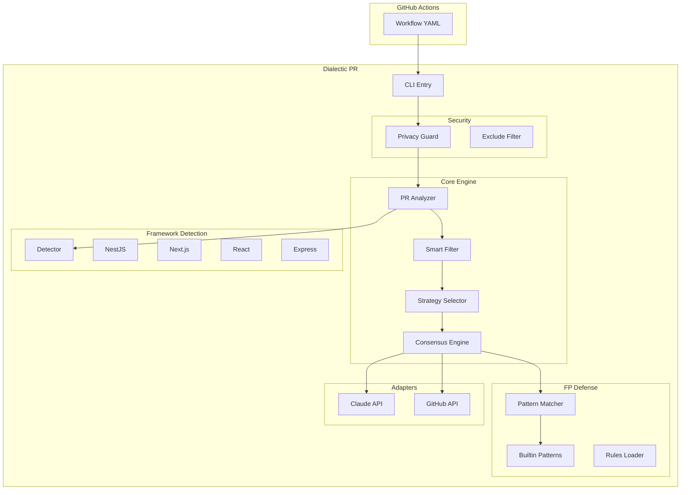

# Dialectic PR

> **The AI Code Reviewer for TypeScript Projects**

False Positive를 최소화하고 프레임워크 컨텍스트를 깊이 이해하는 지능형 PR 리뷰 시스템

## 🎯 핵심 차별화

- **TypeScript/JavaScript 전용**: NestJS, Next.js, React, Express에 특화
- **Consensus Review**: 두 AI 페르소나(Hawk & Owl)의 내부 대화로 노이즈 80% 감소
- **Claude 최적화**: Prompt Caching으로 비용 90% 절감
- **Framework-Aware**: 프레임워크별 Best Practice 자동 적용
- **Smart Filtering**: 핵심 파일 우선순위 기반 지능형 리뷰
- **False Positive Defense**: 30+ 내장 패턴으로 노이즈 최소화

## 📊 구현 상황

### ✅ Phase 1: Core Engine (완료)

```
src/
├── core/
│   ├── types.ts              ✅ 모든 타입 정의
│   ├── analyzer.ts           ✅ PR 분석 엔진
│   ├── smart-filter.ts       ✅ 파일 우선순위 큐
│   ├── strategy-selector.ts  ✅ 크기 기반 전략 선택
│   └── consensus-engine.ts   ✅ Multi-Persona 리뷰 (Prompt Caching)
├── adapters/
│   ├── claude-api.ts         ✅ Claude API (Prompt Caching, Extended Thinking)
│   ├── github-api.ts         ✅ GitHub API (Batch Review)
│   └── retry-handler.ts      ✅ Exponential Backoff
├── security/
│   ├── privacy-guard.ts      ✅ 시크릿 감지
│   └── exclude-filter.ts     ✅ 민감 파일 필터
├── utils/
│   ├── logger.ts             ✅ 로깅
│   ├── config-loader.ts      ✅ 설정 로드
│   └── metrics-calculator.ts ✅ 메트릭 계산
├── cli.ts                    ✅ CLI (init, review)
└── index.ts                  ✅ npm exports
```

### ✅ Phase 2: Framework Specialization (완료)

```
src/frameworks/
├── base-framework.ts    ✅ Framework 인터페이스
├── nestjs.ts            ✅ NestJS 특화 룰 & 패턴
├── nextjs.ts            ✅ Next.js 특화 룰 & 패턴
├── react.ts             ✅ React 특화 룰 & 패턴
├── express.ts           ✅ Express 특화 룰 & 패턴
├── vanilla.ts           ✅ 일반 TS/JS 프로젝트
├── detector.ts          ✅ 자동 프레임워크 감지
└── index.ts             ✅ 자동 등록 & exports
```

### ✅ Phase 3: False Positive Defense (완료)

```
src/false-positive/
├── builtin-patterns.ts      ✅ 30+ 내장 FP 패턴
├── pattern-matcher.ts       ✅ 패턴 매칭 엔진
├── project-rules-loader.ts  ✅ 프로젝트별 룰 로더
└── index.ts                 ✅ exports
```

### 🚧 Phase 4: Testing & Polish (진행 중)

```
tests/unit/
├── pattern-matcher.test.ts      ✅
├── smart-filter.test.ts         ✅
├── strategy-selector.test.ts    ✅
├── frameworks.test.ts           ✅
└── builtin-patterns.test.ts     ✅
```

## 🚀 빠른 시작

### 1. 설치

```bash
npm install @dialectic-pr/core
# 또는
npx @dialectic-pr/core init
```

### 2. 설정

```bash
# 자동 설정 파일 생성
npx @dialectic-pr/core init
```

생성되는 파일:

- `.github/dialectic-pr.json` - 설정 파일
- `.github/workflows/dialectic-pr-review.yml` - GitHub Actions 워크플로우

### 3. GitHub Secrets 설정

```
ANTHROPIC_API_KEY: your-claude-api-key
```

### 4. PR 열기

PR을 열면 자동으로 리뷰가 시작됩니다!

## ⚙️ 설정 옵션

`.github/dialectic-pr.json`:

```json
{
  "$schema": "https://unpkg.com/@dialectic-pr/core/config/dialectic-pr-schema.json",
  "model": "claude-sonnet-4-20250514",
  "exclude_patterns": ["**/.env*", "**/secrets/**"],
  "false_positive_patterns": [
    {
      "id": "custom-pattern",
      "category": "custom",
      "explanation": "프로젝트 특화 패턴 설명",
      "false_positive_indicators": ["무시할 문구"]
    }
  ],
  "framework_specific": {
    "nestjs": {
      "priority_modules": ["auth", "payments"]
    }
  },
  "conventions": {
    "paths": ["CLAUDE.md", "CONVENTIONS.md"]
  }
}
```

## 🏗️ 아키텍처



## 🤖 Multi-Persona Consensus System

Dialectic PR은 단일 API 호출 내에서 두 AI 페르소나가 협력하여 리뷰합니다:

### Hawk (Critical Reviewer)

- 버그, 보안 취약점, 에지 케이스 탐지
- 에러 핸들링, 타입 안전성 집중
- 잠재적 이슈 목록 생성

### Owl (Pragmatic Validator)

- Hawk의 우려사항 검증
- False Positive 패턴 체크
- ROI 평가 및 실용적 필터링

**결과**: 두 페르소나가 **합의한 이슈만** 보고 → 노이즈 80% 감소

## 💰 비용 최적화

### Prompt Caching (90% 비용 절감)

```typescript
// 캐시되는 시스템 메시지
const systemMessages = [
  { text: AGENT_INSTRUCTIONS, cache_control: { type: "ephemeral" } },
  { text: FP_PATTERNS, cache_control: { type: "ephemeral" } },
  { text: FRAMEWORK_RULES, cache_control: { type: "ephemeral" } },
];
```

### 예상 비용

- 첫 PR 리뷰: ~$0.05
- 이후 (캐시 히트): ~$0.005

## 🧪 테스트

```bash
# 단위 테스트
npm test

# 타입 체크
npm run build

# Lint
npm run lint
```

## 📁 프로젝트 구조

```
dialectic-pr/
├── src/
│   ├── core/           # 핵심 리뷰 로직
│   ├── adapters/       # Claude & GitHub API
│   ├── security/       # 보안 레이어
│   ├── frameworks/     # 프레임워크 특화 룰
│   ├── false-positive/ # FP 방어 시스템
│   ├── utils/          # 유틸리티
│   ├── cli.ts          # CLI 엔트리
│   └── index.ts        # npm exports
├── tests/
│   └── unit/           # 단위 테스트
├── specs/              # 상세 스펙 문서
└── dist/               # 빌드 결과물
```

## 🎯 지원 프레임워크

| Framework | 감지 | 특화 룰 | FP 패턴 |
| --------- | ---- | ------- | ------- |
| NestJS    | ✅   | ✅      | ✅      |
| Next.js   | ✅   | ✅      | ✅      |
| React     | ✅   | ✅      | ✅      |
| Express   | ✅   | ✅      | ✅      |
| Vanilla   | ✅   | ✅      | ✅      |

## 📝 API

### 프로그래매틱 사용

```typescript
import {
  PRAnalyzer,
  ConsensusEngine,
  ClaudeAdapter,
  FrameworkDetector,
  PatternMatcher,
  BUILTIN_PATTERNS,
} from "@dialectic-pr/core";

// Claude Adapter 초기화
const claude = new ClaudeAdapter(apiKey);

// PR 분석
const analyzer = new PRAnalyzer(excludeFilter, smartFilter, detector);
const analysis = await analyzer.analyze(diff, files, prInfo, repoPath);

// 리뷰 생성
const engine = new ConsensusEngine(claude);
const result = await engine.generateReview(analysis, strategy, fpPatterns);

// FP 필터링
const matcher = new PatternMatcher(BUILTIN_PATTERNS);
const { filtered } = matcher.filterIssues(result.issues);
```

## 🤝 기여하기

1. Fork the repository
2. Create your feature branch (`git checkout -b feature/amazing-feature`)
3. Commit your changes (`git commit -m 'Add some amazing feature'`)
4. Push to the branch (`git push origin feature/amazing-feature`)
5. Open a Pull Request

## 📄 라이센스

MIT

## 📮 지원

- [GitHub Issues](https://github.com/dialectic-pr/dialectic-pr/issues)
- [Documentation](https://github.com/dialectic-pr/dialectic-pr#readme)
