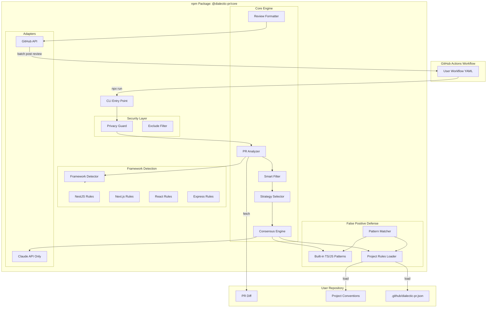
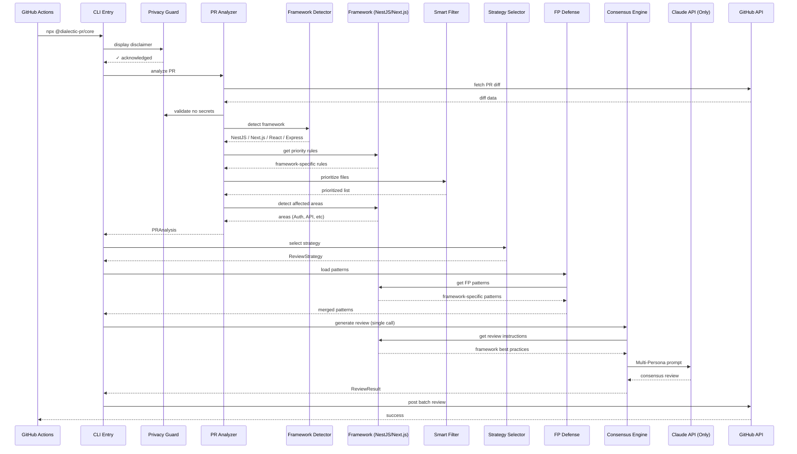

# Dialectic PR - MVP 스펙 (v1.0.0)

## 1. 프로젝트 개요

### 목적

**TypeScript/JavaScript 프로젝트 전용** AI 코드 리뷰어로, False Positive를 최소화하고 프레임워크 컨텍스트를 깊이 이해하는 지능형 시스템

### 핵심 차별화 요소

- **TypeScript/JavaScript 특화**: npm 생태계에 최적화된 리뷰 (NestJS, Next.js, React, Express)
- **Consensus Review System**: 단일 API 호출 내 두 페르소나의 내부 대화로 품질 향상 (비용 효율적)
- **False Positive 방어**: TS/JS 생태계 특화 패턴 매칭으로 노이즈 80% 감소
- **ROI 중심**: Production 버그 방지 + 고확률 + 고ROI 3가지 모두 만족 시만 이슈 제기
- **Smart Filtering**: 핵심 파일 우선순위 기반 지능형 컨텍스트 관리
- **Framework-Aware**: 프레임워크별 Best Practice와 안티패턴 자동 감지

### 타겟 사용자

- TypeScript/JavaScript 개발자
- NestJS, Next.js, React, Express 프로젝트
- npm/pnpm/yarn을 사용하는 Node.js 생태계

### 배포 형태

- **npm 패키지**: `@dialectic-pr/core`
- **사용 방식**: GitHub Actions에서 `npx @dialectic-pr/core`
- **라이센스**: MIT

---

## 2. 아키텍처



---

## 3. 패키지 구조

```javascript
dialectic-pr/
├── package.json
├── tsconfig.json
├── README.md
├── LICENSE (MIT)
├── .npmignore
│
├── src/
│   ├── index.ts                          # npm 패키지 엔트리
│   ├── cli.ts                            # CLI 인터페이스
│   │
│   ├── core/
│   │   ├── analyzer.ts                   # PR 분석 (diff, metrics)
│   │   ├── smart-filter.ts               # 핵심 파일 우선순위 필터링
│   │   ├── strategy-selector.ts          # 크기 기반 전략 결정
│   │   ├── consensus-engine.ts           # Consensus Review 로직
│   │   ├── review-formatter.ts           # 리뷰 메시지 포맷팅
│   │   └── types.ts                      # 공통 타입 정의
│   │
│   ├── frameworks/
│   │   ├── detector.ts                   # 프레임워크 자동 감지
│   │   ├── base-framework.ts             # 프레임워크 인터페이스
│   │   ├── nestjs.ts                     # NestJS 특화 룰 & 패턴
│   │   ├── nextjs.ts                     # Next.js 특화 룰 & 패턴
│   │   ├── react.ts                      # React 특화 룰 & 패턴
│   │   ├── express.ts                    # Express 특화 룰 & 패턴
│   │   └── vanilla.ts                    # 일반 TS/JS 프로젝트
│   │
│   ├── false-positive/
│   │   ├── builtin-patterns.ts           # 내장 TS/JS FP 패턴
│   │   ├── pattern-matcher.ts            # 패턴 매칭 엔진
│   │   ├── project-rules-loader.ts       # 프로젝트별 룰 로더
│   │   └── schema.ts                     # dialectic-pr.json 스키마
│   │
│   ├── adapters/
│   │   ├── claude-api.ts                 # Claude API 클라이언트 (단일)
│   │   ├── github-api.ts                 # GitHub API 클라이언트 (Batch Review)
│   │   └── retry-handler.ts              # 재시도 로직
│   │
│   ├── security/
│   │   ├── privacy-guard.ts              # 데이터 전송 경고 및 검증
│   │   └── exclude-filter.ts             # 민감 파일 제외 필터
│   │
│   ├── prompts/
│   │   ├── base-prompt.ts                # 기본 프롬프트 템플릿
│   │   ├── consensus-prompt.ts           # Multi-Persona Consensus 프롬프트
│   │   └── framework-specific/
│   │       ├── nestjs.ts                 # NestJS 프롬프트 섹션
│   │       ├── nextjs.ts                 # Next.js 프롬프트 섹션
│   │       └── react.ts                  # React 프롬프트 섹션
│   │
│   └── utils/
│       ├── logger.ts                     # 로깅
│       ├── config-loader.ts              # 설정 로더
│       └── metrics-calculator.ts         # 메트릭 계산
│
├── config/
│   ├── default-config.json               # 기본 설정
│   ├── dialectic-pr-schema.json          # 설정 JSON 스키마
│   └── conventions-schema.json           # 프로젝트 컨벤션 스키마
│
├── templates/
│   ├── dialectic-pr.json                 # init 명령용 설정 템플릿
│   └── workflow.yml                      # init 명령용 워크플로우 템플릿
│
├── tests/
│   ├── unit/
│   ├── integration/
│   └── fixtures/
│       ├── nestjs-project/               # NestJS 테스트 케이스
│       ├── nextjs-project/               # Next.js 테스트 케이스
│       └── react-project/                # React 테스트 케이스
│
└── examples/
    ├── before-after/                     # Before(타사) vs After(Dialectic) 비교
    │   ├── noisy-review-before.png
    │   ├── clean-review-after.png
    │   └── comparison.md
    ├── nestjs-app/                       # NestJS 예제
    │   ├── .github/workflows/review.yml
    │   └── .github/dialectic-pr.json
    ├── nextjs-app/                       # Next.js 예제
    │   ├── .github/workflows/review.yml
    │   └── .github/dialectic-pr.json
    └── react-express-fullstack/          # Full-stack 예제
        ├── .github/workflows/review.yml
        └── .github/dialectic-pr.json
```

---

## 4. 핵심 모듈 상세 스펙

### 4.1 CLI Interface (`src/cli.ts`)

**책임**: GitHub Actions에서 호출되는 진입점

**명령어 구조**:

```bash
# 기본 리뷰 실행
npx @dialectic-pr/core

# 초기 설정 파일 생성 (신규 추가)
npx @dialectic-pr/core init

# 테스트 모드
npx @dialectic-pr/core --dry-run

# 강제 전체 리뷰 (증분 리뷰 무시)
npx @dialectic-pr/core --force-review
```

**init 명령어** (DX 핵심 기능):

```typescript
async function initCommand(): Promise<void> {
  // 1. .github/dialectic-pr.json 템플릿 생성
  await copyTemplate("dialectic-pr.json", ".github/dialectic-pr.json");

  // 2. .github/workflows/dialectic-pr-review.yml 생성
  await copyTemplate(
    "workflow.yml",
    ".github/workflows/dialectic-pr-review.yml"
  );

  // 3. 사용자 가이드 출력
  console.log(`
✅ Dialectic PR 설정 완료!

생성된 파일:
  - .github/dialectic-pr.json (설정 파일)
  - .github/workflows/dialectic-pr-review.yml (워크플로우)

다음 단계:
  1. GitHub Secrets에 ANTHROPIC_API_KEY 추가
  2. PR을 열어 첫 리뷰 받기

문서: https://github.com/dialectic-pr/dialectic-pr#readme
  `);
}
```

**입력 (환경변수 or CLI args)**:

```typescript
interface CLIOptions {
  anthropicApiKey: string; // ANTHROPIC_API_KEY (필수)
  githubToken: string; // GITHUB_TOKEN (필수)
  owner: string; // PR owner
  repo: string; // PR repo
  pullNumber: number; // PR number
  baseBranch: string; // 베이스 브랜치
  configPath?: string; // 커스텀 설정 경로
  dryRun?: boolean; // 테스트 모드
  forceReview?: boolean; // 증분 리뷰 무시하고 전체 리뷰
}
```

**출력**:

- Exit code 0: 성공
- Exit code 1: 실패
- stdout: 진행 로그 (Privacy 경고 포함)
- GitHub PR에 리뷰 코멘트 작성

### 4.2 Security Layer (`src/security/`)

**Privacy Guard** (`privacy-guard.ts`):

```typescript
class PrivacyGuard {
  displayDisclaimer(): void {
    console.log(`
╔════════════════════════════════════════════════════════════════════╗
║  ⚠️  DATA PRIVACY NOTICE                                           ║
║                                                                    ║
║  Your code diff will be sent to Anthropic's Claude API for        ║
║  analysis. By continuing, you acknowledge this data transfer.     ║
║                                                                    ║
║  To exclude sensitive files, configure 'exclude_patterns' in      ║
║  your .github/dialectic-pr.json                                   ║
║                                                                    ║
║  Docs: https://github.com/dialectic-pr/dialectic-pr#privacy       ║
╚════════════════════════════════════════════════════════════════════╝
    `);
  }

  validateNoSecrets(diff: string): void {
    // 기본적인 시크릿 패턴 감지 (API 키, 토큰 등)
    const secretPatterns = [
      /['"]?[a-zA-Z_]*(?:API_KEY|SECRET|TOKEN|PASSWORD)['"]?\s*[:=]\s*['"][^'"]+['"]/gi,
      /-----BEGIN (?:RSA|DSA|EC|OPENSSH) PRIVATE KEY-----/,
    ];

    for (const pattern of secretPatterns) {
      if (pattern.test(diff)) {
        throw new Error(
          "Potential secret detected in diff. Review aborted for security."
        );
      }
    }
  }
}
```

**Exclude Filter** (`exclude-filter.ts`):

```typescript
class ExcludeFilter {
  private defaultExcludes = [
    // 민감한 파일
    "**/.env*",
    "**/secrets/**",
    "**/*.pem",
    "**/*.key",

    // 바이너리/생성 파일
    "**/*.lock",
    "**/package-lock.json",
    "**/yarn.lock",
    "**/pnpm-lock.yaml",
    "**/*.min.js",
    "**/*.min.css",
    "**/*.svg",
    "**/*.png",
    "**/*.jpg",
    "**/*.ico",

    // 빌드 결과물
    "**/dist/**",
    "**/build/**",
    "**/node_modules/**",
    "**/__pycache__/**",
  ];

  constructor(private customExcludes: string[] = []) {}

  shouldExclude(filePath: string): boolean {
    const allPatterns = [...this.defaultExcludes, ...this.customExcludes];
    return allPatterns.some((pattern) => minimatch(filePath, pattern));
  }

  filterFiles(files: string[]): string[] {
    return files.filter((f) => !this.shouldExclude(f));
  }
}
```

### 4.3 PR Analyzer (`src/core/analyzer.ts`)

**책임**: PR의 변경사항을 분석하고 메트릭 계산

**주요 기능**:

```typescript
class PRAnalyzer {
  constructor(
    private excludeFilter: ExcludeFilter,
    private smartFilter: SmartFilter,
    private frameworkDetector: FrameworkDetector
  ) {}

  async analyze(pr: PullRequest): Promise<PRAnalysis> {
    // 1. Diff 생성 (git diff origin/base...HEAD)
    // 2. 민감 파일 제외 (ExcludeFilter)
    // 3. 변경 통계 (파일 수, 추가/삭제 라인)
    // 4. 프레임워크 감지 (NestJS, Next.js, React, Express)
    // 5. 핵심 파일 우선순위 지정 (SmartFilter)
    // 6. 영향받는 영역 감지 (auth, payments, etc)
    // 7. 컨텍스트 플래그 (테스트 변경, 스키마 변경, etc)
  }

  detectAffectedAreas(files: string[], framework: Framework): string[];
  calculateMetrics(diff: string): Metrics;
  isConfigOnly(files: string[]): boolean;
  isCriticalModule(files: string[], framework: Framework): boolean;
}
```

**출력 타입**:

```typescript
interface PRAnalysis {
  diff: string; // 전체 diff
  relevantDiff: string; // 필터링된 diff (TS/JS 소스코드만)
  prioritizedDiff: string; // 우선순위 정렬된 diff (토큰 제한 내)
  metrics: {
    fileCount: number;
    addedLines: number;
    deletedLines: number;
    diffSize: number; // bytes
    coreFileCount: number; // 핵심 파일 수
    tsFileCount: number; // TypeScript 파일 수
    jsFileCount: number; // JavaScript 파일 수
  };
  context: {
    framework: DetectedFramework; // NestJS | Next.js | React | Express | Vanilla
    affectedAreas: string[]; // ["Auth", "Payments"]
    flags: {
      testChanged: boolean;
      schemaChanged: boolean;
      apiRoutesChanged: boolean; // Next.js API routes
      controllersChanged: boolean; // NestJS controllers
      criticalModule: boolean;
      configOnly: boolean;
    };
  };
  changedFiles: string[];
  prioritizedFiles: PrioritizedFile[]; // 우선순위 정렬된 파일 목록
  excludedFiles: string[]; // 제외된 파일 (로깅용)
}

interface PrioritizedFile {
  path: string;
  priority: "critical" | "high" | "normal" | "low";
  reason: string; // 우선순위 결정 이유
}

interface DetectedFramework {
  name: "nestjs" | "nextjs" | "react" | "express" | "vanilla";
  version?: string;
  confidence: "high" | "medium" | "low";
}
```

### 4.4 Smart Filter (`src/core/smart-filter.ts`)

**책임**: 토큰 한도 내에서 핵심 파일 우선순위 큐 관리

```typescript
type FilePriority = "critical" | "high" | "normal" | "low";

interface PriorityRule {
  pattern: RegExp | string;
  priority: FilePriority;
  reason: string;
}

class SmartFilter {
  private priorityRules: PriorityRule[] = [
    // Critical: 핵심 비즈니스 로직
    {
      pattern: /src\/(auth|payments|billing|security)\//,
      priority: "critical",
      reason: "Security-critical module",
    },
    {
      pattern: /src\/core\//,
      priority: "critical",
      reason: "Core business logic",
    },

    // High: 중요 소스 코드
    {
      pattern: /src\/.*\.(ts|tsx|js|jsx|py|java|go)$/,
      priority: "high",
      reason: "Source code",
    },
    {
      pattern: /\.(controller|service|repository|handler)\.(ts|js)$/,
      priority: "high",
      reason: "Business layer",
    },

    // Normal: 일반 코드
    {
      pattern: /\.(ts|tsx|js|jsx|py|java|go)$/,
      priority: "normal",
      reason: "Code file",
    },

    // Low: 낮은 우선순위
    {
      pattern: /\.test\.(ts|tsx|js|jsx)$/,
      priority: "low",
      reason: "Test file",
    },
    {
      pattern: /\.spec\.(ts|tsx|js|jsx)$/,
      priority: "low",
      reason: "Spec file",
    },
    {
      pattern: /\.(md|txt|json|yaml|yml)$/,
      priority: "low",
      reason: "Config/Doc file",
    },
  ];

  prioritizeFiles(files: ChangedFile[]): PrioritizedFile[] {
    return files
      .map((file) => ({
        ...file,
        priority: this.determinePriority(file.path),
        reason: this.getPriorityReason(file.path),
      }))
      .sort(
        (a, b) =>
          this.priorityOrder(a.priority) - this.priorityOrder(b.priority)
      );
  }

  truncateToTokenLimit(
    prioritizedFiles: PrioritizedFile[],
    tokenLimit: number
  ): { included: PrioritizedFile[]; excluded: PrioritizedFile[] } {
    const included: PrioritizedFile[] = [];
    const excluded: PrioritizedFile[] = [];
    let currentTokens = 0;

    for (const file of prioritizedFiles) {
      const fileTokens = this.estimateTokens(file.content);

      if (currentTokens + fileTokens <= tokenLimit) {
        included.push(file);
        currentTokens += fileTokens;
      } else {
        excluded.push(file);
      }
    }

    // 제외된 파일이 있으면 경고 로그
    if (excluded.length > 0) {
      console.log(
        `⚠️ Token limit reached. ${excluded.length} files excluded from review:`
      );
      excluded
        .slice(0, 5)
        .forEach((f) =>
          console.log(`   - ${f.path} (${f.priority}: ${f.reason})`)
        );
      if (excluded.length > 5) {
        console.log(`   ... and ${excluded.length - 5} more`);
      }
    }

    return { included, excluded };
  }

  private priorityOrder(priority: FilePriority): number {
    const order = { critical: 0, high: 1, normal: 2, low: 3 };
    return order[priority];
  }

  private estimateTokens(content: string): number {
    // 대략적인 토큰 추정 (4 chars ≈ 1 token)
    return Math.ceil(content.length / 4);
  }
}
```

### 4.5 Strategy Selector (`src/core/strategy-selector.ts`)

**책임**: PR 크기와 컨텍스트에 따라 리뷰 전략 선택

```typescript
interface ReviewStrategy {
  name: "small" | "medium" | "large" | "xlarge" | "skip";
  maxTokens: number;
  contextTokenBudget: number; // 컨텍스트용 토큰 예산
  instructions: string; // 전략별 리뷰 지침
}

class StrategySelector {
  select(analysis: PRAnalysis): ReviewStrategy {
    const { diffSize, coreFileCount } = analysis.metrics;
    const { criticalModule, configOnly } = analysis.context.flags;

    // Config-only 변경은 빠르게 처리
    if (configOnly) {
      return { ...STRATEGIES.small, instructions: "Config review only" };
    }

    // Critical 모듈은 토큰 예산 증가
    const criticalBoost = criticalModule ? 1.5 : 1;

    // 기본 전략 선택
    let strategy: ReviewStrategy;
    if (diffSize < 51200) {
      strategy = STRATEGIES.small;
    } else if (diffSize < 153600) {
      strategy = STRATEGIES.medium;
    } else if (diffSize < 204800) {
      strategy = STRATEGIES.large;
    } else if (diffSize < 819200) {
      strategy = STRATEGIES.xlarge;
    } else {
      strategy = STRATEGIES.skip;
    }

    // Critical boost 적용
    return {
      ...strategy,
      maxTokens: Math.floor(strategy.maxTokens * criticalBoost),
    };
  }
}
```

### 4.6 Consensus Engine (`src/core/consensus-engine.ts`)

**책임**: Single-Call Multi-Persona Consensus Review 구현

> **설계 결정**: MVP에서는 **단일 API 호출 내 Multi-Persona Prompting** 방식을 채택합니다.
> 두 번의 API 호출 대신, 하나의 프롬프트 내에서 두 페르소나가 대화하고 합의하도록 구성하여
> 비용을 50% 절감하면서도 Consensus의 핵심 가치를 유지합니다.

**핵심 로직**:

```typescript
class ConsensusEngine {
  constructor(
    private claudeAdapter: ClaudeAdapter,
    private config: ConsensusConfig
  ) {}

  async generateReview(
    analysis: PRAnalysis,
    strategy: ReviewStrategy,
    fpPatterns: FalsePositivePattern[],
    projectContext: ProjectContext
  ): Promise<ReviewResult> {
    // 1. Multi-Persona Consensus 프롬프트 구성
    const prompt = this.buildMultiPersonaPrompt({
      analysis,
      strategy,
      fpPatterns,
      projectContext,
    });

    // 2. 단일 Claude API 호출
    const response = await this.claudeAdapter.sendMessage(prompt, {
      maxTokens: strategy.maxTokens,
      model: this.config.model,
    });

    // 3. 응답 파싱
    return this.parseReview(response);
  }

  private buildMultiPersonaPrompt(params: PromptParams): string {
    return `
# AGENT CONSENSUS REVIEW SYSTEM

You are TWO distinct code review personas working together:

## PERSONA A: "Hawk" (The Critical Reviewer)
- Finds potential issues, bugs, security vulnerabilities
- Tends to raise concerns and ask questions
- Focuses on edge cases and error handling

## PERSONA B: "Owl" (The Pragmatic Validator)
- Validates Hawk's concerns against project context
- Considers false positive patterns
- Filters out noise and non-actionable feedback

## REVIEW PROCESS (Internal)
1. Hawk reviews the diff and identifies potential issues
2. Owl validates each issue against:
   - Project's known false positive patterns
   - Context and conventions
   - ROI (Is this worth mentioning?)
3. Only issues that BOTH personas agree on should be reported

## FALSE POSITIVE PATTERNS TO IGNORE
${this.formatFPPatterns(params.fpPatterns)}

## PROJECT CONTEXT
${params.projectContext.conventions}

## REVIEW STRATEGY: ${params.strategy.name}
${params.strategy.instructions}

## DIFF TO REVIEW
\`\`\`diff
${params.analysis.prioritizedDiff}
\`\`\`

## OUTPUT FORMAT
Report ONLY issues that passed consensus. For each issue:
- File path and line number
- Issue type (bug/security/performance/maintainability)
- Confidence level (high/medium)
- Brief explanation
- Suggested fix (if applicable)

If no consensus issues found, respond with "✅ No significant issues found."

Remember: Quality over quantity. One actionable issue is better than ten noisy ones.
`;
  }
}
```

### 4.7 False Positive Defense (`src/false-positive/`)

**책임**: 레이어드 FP 방어 시스템

**내장 패턴** (`builtin-patterns.ts`):

```typescript
export const BUILTIN_PATTERNS: FalsePositivePattern[] = [
  {
    id: "prisma-tagged-template-safe",
    category: "sql-injection",
    pattern: /\$executeRaw`.*\$\{.*\}`/,
    explanation: "Prisma tagged template literals auto-escape all ${} values",
    severity: "critical",
    falsePositiveIndicators: [
      "SQL Injection in Prisma $executeRaw",
      "parameter binding bypass",
      "constant directly inserted",
    ],
  },
  {
    id: "nestjs-throw-error-with-filter",
    category: "error-handling",
    pattern: /throw error/,
    explanation: "AllExceptionsFilter converts all errors to 500",
    contextRequired: ["AllExceptionsFilter", "common/filters"],
    falsePositiveIndicators: [
      "DB error exposure",
      "InternalServerErrorException needed",
    ],
  },
  // ... 현재 워크플로우의 326-458줄의 모든 패턴
];
```

**프로젝트별 오버라이드** (`project-rules-loader.ts`):

```typescript
class ProjectRulesLoader {
  async load(repoPath: string): Promise<ProjectRules> {
    // 1. .github/dialectic-pr.json 로드
    const config = await this.loadConfig(repoPath);

    // 2. 프로젝트 컨벤션 로드 (CLAUDE.md, principles/, etc)
    const conventions = await this.loadConventions(repoPath);

    // 3. 내장 패턴과 머지
    return {
      patterns: [...BUILTIN_PATTERNS, ...config.patterns],
      conventions,
      overrides: config.overrides,
      excludePatterns: config.exclude_patterns,
    };
  }
}
```

**설정 스키마** (`dialectic-pr.json`):

```json
{
  "$schema": "./node_modules/@dialectic-pr/core/config/dialectic-pr-schema.json",
  "model": "claude-sonnet-4-20250514",
  "exclude_patterns": [
    "**/.env.template",
    "**/secrets/**",
    "**/internal-docs/**"
  ],
  "strategies": {
    "small": { "maxTokens": 16000 },
    "medium": { "maxTokens": 12000 },
    "large": { "maxTokens": 8000 }
  },
  "false_positive_patterns": [
    {
      "id": "custom-pattern-1",
      "category": "custom",
      "explanation": "Project-specific false positive",
      "false_positive_indicators": ["specific phrase to ignore"]
    }
  ],
  "framework_specific": {
    "nestjs": {
      "disabled_builtin_patterns": ["pattern-id-to-disable"],
      "custom_patterns": [],
      "priority_modules": ["auth", "payments"]
    },
    "nextjs": {
      "app_router": true,
      "check_client_components": true
    }
  },
  "conventions": {
    "paths": ["CLAUDE.md", "principles/refactoring-pipeline.md"],
    "sections": {
      "CLAUDE.md": ["### 2.2 데이터베이스 및 BigInt 처리"]
    }
  }
}
```

### 4.8 Framework Detection System (`src/frameworks/`)

**책임**: 프로젝트의 프레임워크를 자동 감지하고 특화 룰 적용

**Framework Detector** (`detector.ts`):

```typescript
class FrameworkDetector {
  async detect(rootPath: string, files: string[]): Promise<DetectedFramework> {
    // 1. package.json 의존성 확인
    const packageJson = await this.readPackageJson(rootPath);

    // 2. 파일 구조 패턴 확인
    if (this.isNestJS(packageJson, files)) {
      return {
        name: "nestjs",
        confidence: "high",
        version: packageJson.dependencies["@nestjs/core"],
      };
    }

    if (this.isNextJS(packageJson, files)) {
      return {
        name: "nextjs",
        confidence: "high",
        version: packageJson.dependencies.next,
      };
    }

    if (this.isReact(packageJson, files)) {
      return {
        name: "react",
        confidence: "high",
        version: packageJson.dependencies.react,
      };
    }

    if (this.isExpress(packageJson, files)) {
      return {
        name: "express",
        confidence: "medium",
        version: packageJson.dependencies.express,
      };
    }

    return { name: "vanilla", confidence: "high" };
  }

  private isNestJS(pkg: PackageJson, files: string[]): boolean {
    return (
      pkg.dependencies?.["@nestjs/core"] !== undefined ||
      files.some((f) => f.includes("main.ts") && f.includes("NestFactory"))
    );
  }

  private isNextJS(pkg: PackageJson, files: string[]): boolean {
    return (
      pkg.dependencies?.next !== undefined ||
      files.some((f) => f.includes("next.config"))
    );
  }
}
```

**프레임워크 인터페이스**:

```typescript
interface Framework {
  name: string;

  // 프레임워크별 리뷰 지침
  getReviewInstructions(): string;

  // 프레임워크별 FP 패턴
  getFalsePositivePatterns(): FalsePositivePattern[];

  // 영역 감지 (프레임워크 구조에 맞춰)
  detectAffectedAreas(files: string[]): string[];

  // 프레임워크별 우선순위 룰
  getPriorityRules(): PriorityRule[];
}
```

**NestJS Framework 예시** (`nestjs.ts`):

```typescript
class NestJSFramework implements Framework {
  name = "nestjs";

  getReviewInstructions(): string {
    return `
## NestJS Best Practices
- **Dependency Injection**: Always use constructor injection, not property injection
- **Guards vs Interceptors**: Guards for auth, Interceptors for transformation
- **Exception Filters**: Use custom exception filters for consistent error responses
- **DTOs**: Use class-validator for validation DTOs
- **Modules**: Keep modules focused and avoid circular dependencies
- **Testing**: Use NestJS testing utilities, not raw Jest
    `;
  }

  getFalsePositivePatterns(): FalsePositivePattern[] {
    return [
      {
        id: "nestjs-throw-error-with-filter",
        category: "error-handling",
        explanation:
          "AllExceptionsFilter converts all errors to proper HTTP responses",
        falsePositiveIndicators: [
          "throw new Error should be InternalServerErrorException",
          "DB error exposure risk",
        ],
      },
      {
        id: "nestjs-constructor-di",
        category: "dependency-injection",
        explanation:
          "NestJS manages DI lifecycle, manual instantiation is intentional for DTOs/entities",
        falsePositiveIndicators: [
          "should use dependency injection instead of new",
          "tight coupling with new keyword",
        ],
      },
      // ... 더 많은 NestJS 특화 패턴
    ];
  }

  detectAffectedAreas(files: string[]): string[] {
    const areas = [];
    if (files.some((f) => f.includes("/auth/"))) areas.push("🔐 Auth");
    if (files.some((f) => f.includes("/payments/"))) areas.push("💳 Payments");
    if (files.some((f) => f.match(/\.(controller|guard|interceptor)\.ts$/))) {
      areas.push("🎯 HTTP Layer");
    }
    if (files.some((f) => f.match(/\.(service|repository)\.ts$/))) {
      areas.push("⚙️ Business Logic");
    }
    if (files.some((f) => f.includes(".entity.ts"))) {
      areas.push("🗄️ Database Schema");
    }
    return areas;
  }

  getPriorityRules(): PriorityRule[] {
    return [
      {
        pattern: /\.(controller|guard|middleware)\.ts$/,
        priority: "critical",
        reason: "HTTP security layer",
      },
      {
        pattern: /\.(service|repository)\.ts$/,
        priority: "high",
        reason: "Business logic",
      },
      { pattern: /\.entity\.ts$/, priority: "high", reason: "Database schema" },
      {
        pattern: /\.dto\.ts$/,
        priority: "normal",
        reason: "Data transfer object",
      },
    ];
  }
}
```

**Next.js Framework 예시** (`nextjs.ts`):

```typescript
class NextJSFramework implements Framework {
  name = "nextjs";

  getReviewInstructions(): string {
    return `
## Next.js Best Practices
- **Server Components**: Prefer Server Components, mark Client Components explicitly
- **Data Fetching**: Use async Server Components, not useEffect for data
- **API Routes**: Validate input, use proper HTTP status codes
- **Metadata**: Use generateMetadata for SEO
- **Image**: Always use next/image for optimization
- **Performance**: Check for client-side JS bloat
    `;
  }

  detectAffectedAreas(files: string[]): string[] {
    const areas = [];
    if (files.some((f) => f.includes("/api/"))) areas.push("🔌 API Routes");
    if (files.some((f) => f.includes("/app/") && f.includes("page.tsx"))) {
      areas.push("📄 Pages");
    }
    if (files.some((f) => f.includes("layout.tsx"))) areas.push("🎨 Layouts");
    if (files.some((f) => f.includes("/components/")))
      areas.push("🧩 Components");
    return areas;
  }

  getPriorityRules(): PriorityRule[] {
    return [
      {
        pattern: /\/api\/.*\.ts$/,
        priority: "critical",
        reason: "API endpoint",
      },
      {
        pattern: /\/auth\/.*\.tsx?$/,
        priority: "critical",
        reason: "Auth logic",
      },
      { pattern: /page\.tsx$/, priority: "high", reason: "Page component" },
      { pattern: /layout\.tsx$/, priority: "high", reason: "Layout component" },
    ];
  }
}
```

### 4.9 Adapters

**Claude API Adapter** (`src/adapters/claude-api.ts`):

> **MVP 범위**: Claude만 지원합니다. OpenAI, Gemini 등 다른 LLM은 지원하지 않습니다.
> 이는 프롬프트 최적화와 품질 일관성을 위한 전략적 결정입니다.

```typescript
class ClaudeAdapter {
  private readonly defaultModel = "claude-sonnet-4-20250514"; // 설정으로 변경 가능
  private readonly apiEndpoint = "https://api.anthropic.com/v1/messages";

  constructor(
    private apiKey: string,
    private retryHandler: RetryHandler,
    private config: ClaudeConfig
  ) {}

  async sendMessage(prompt: string, options: ClaudeOptions): Promise<string> {
    return await this.retryHandler.execute(async () => {
      const response = await fetch(this.apiEndpoint, {
        method: "POST",
        headers: {
          "Content-Type": "application/json",
          "x-api-key": this.apiKey,
          "anthropic-version": "2023-06-01",
        },
        body: JSON.stringify({
          model: options.model || this.config.model || this.defaultModel,
          max_tokens: options.maxTokens,
          messages: [{ role: "user", content: prompt }],
        }),
      });

      if (!response.ok) {
        const error = await response.json();
        throw new APIError(response.status, error);
      }

      const data = await response.json();
      return data.content[0].text;
    });
  }

  // 토큰 사용량 추적 (비용 모니터링)
  async sendMessageWithUsage(
    prompt: string,
    options: ClaudeOptions
  ): Promise<{ text: string; usage: TokenUsage }> {
    // ... Claude API response의 usage 필드 활용
  }
}

interface TokenUsage {
  inputTokens: number;
  outputTokens: number;
  totalCost: number; // USD 기준
}
```

**GitHub API Adapter** (`src/adapters/github-api.ts`):

> **중요**: Rate Limit 방지를 위해 **Review Batching** 방식 사용

```typescript
class GitHubAdapter {
  /**
   * Batch Review 방식으로 코멘트 작성
   * 개별 코멘트 API 호출 대신 하나의 Review로 묶어서 전송
   */
  async postBatchReview(params: BatchReviewParams): Promise<void> {
    const { owner, repo, prNumber, comments, body, event } = params;

    // 1. Draft Review 생성 및 코멘트 일괄 추가
    await this.octokit.pulls.createReview({
      owner,
      repo,
      pull_number: prNumber,
      body,
      event: event || "COMMENT", // COMMENT | APPROVE | REQUEST_CHANGES
      comments: comments.map((c) => ({
        path: c.path,
        position: c.position, // diff position
        body: c.body,
      })),
    });
  }

  async getPRDiff(
    owner: string,
    repo: string,
    prNumber: number
  ): Promise<string> {
    const { data } = await this.octokit.pulls.get({
      owner,
      repo,
      pull_number: prNumber,
      mediaType: { format: "diff" },
    });
    return data as unknown as string;
  }

  async addLabels(
    owner: string,
    repo: string,
    prNumber: number,
    labels: string[]
  ): Promise<void> {
    await this.octokit.issues.addLabels({
      owner,
      repo,
      issue_number: prNumber,
      labels,
    });
  }
}
```

---

## 5. 설정 파일 구조

### 5.1 사용자가 작성하는 파일 (프로젝트별)

**`.github/workflows/dialectic-pr-review.yml`**:

```yaml
name: Dialectic PR Review

on:
  pull_request:
    types: [opened, synchronize, labeled]

permissions:
  contents: read
  pull-requests: write

jobs:
  review:
    runs-on: ubuntu-latest
    if: |
      github.event.pull_request.draft == false &&
      !contains(github.event.pull_request.labels.*.name, 'skip-ai-review')

    steps:
      - name: Checkout
        uses: actions/checkout@v4
        with:
          fetch-depth: 0

      - name: Dialectic PR Review
        run: npx @dialectic-pr/core
        env:
          ANTHROPIC_API_KEY: ${{ secrets.ANTHROPIC_API_KEY }}
          GITHUB_TOKEN: ${{ secrets.GITHUB_TOKEN }}
```

**`.github/dialectic-pr.json`** (선택적, `npx @dialectic-pr/core init`으로 생성):

```json
{
  "$schema": "https://unpkg.com/@dialectic-pr/core/config/dialectic-pr-schema.json",
  "model": "claude-sonnet-4-20250514",
  "exclude_patterns": ["**/.env*", "**/secrets/**"],
  "false_positive_patterns": [
    {
      "id": "our-custom-logger-pattern",
      "category": "logging",
      "explanation": "We use custom Logger with DI pattern in NestJS",
      "false_positive_indicators": [
        "Logger should not use DI",
        "new Logger(ClassName.name) is anti-pattern"
      ]
    }
  ],
  "framework_specific": {
    "nestjs": {
      "priority_modules": ["auth", "payments", "billing"]
    }
  }
}
```

### 5.2 패키지에 포함된 파일 (변하지 않음)

- `config/default-config.json`: 기본 설정
- `config/dialectic-pr-schema.json`: JSON 스키마
- `templates/`: init 명령용 템플릿들
- `src/false-positive/builtin-patterns.ts`: 내장 FP 패턴
- `src/prompts/`: 프롬프트 템플릿들
- `src/plugins/`: 언어별 플러그인

---

## 6. 데이터 플로우



---

## 7. MVP 구현 범위

> **총 기간: 3-4주** (멀티언어 제거로 6주 → 3-4주 단축)

### Phase 1: Core Engine (Week 1)

- CLI 인터페이스 (`init`, `--dry-run`, `--force-review`)
- Security Layer (Privacy Guard, Exclude Filter)
- PR Analyzer
- Smart Filter
- Strategy Selector
- Consensus Engine (Multi-Persona Prompting)
- Claude API Adapter (재시도 로직 포함)
- GitHub API Adapter (Batch Review)

### Phase 2: Framework Detection (Week 2)

- Framework Detector (자동 감지 로직)
- NestJS Framework (Rules + FP Patterns)
- Next.js Framework (Rules + FP Patterns)
- React Framework (Rules + FP Patterns)
- Express Framework (Rules + FP Patterns)
- Vanilla TS/JS Framework (기본)

### Phase 3: False Positive Defense (Week 2-3)

- Builtin TS/JS patterns (현재 워크플로우의 패턴 + 추가 수집)
- Pattern Matcher
- Project rules loader
- dialectic-pr.json 스키마 정의
- 프레임워크별 특화 패턴 통합

### Phase 4: Integration & Testing (Week 3)

- 현재 프로젝트에 통합 테스트
- Unit tests (각 프레임워크별)
- Integration tests (전체 플로우)
- Fixtures (NestJS, Next.js, React 프로젝트)
- 문서화 (README, API docs)

### Phase 5: Publishing (Week 4)

- npm 퍼블리싱 준비
- 예제 프로젝트 3개 (NestJS, Next.js, React+Express)
- Before/After 비교 자료 (examples/before-after/)
- GitHub README 작성 (타겟: TS/JS 개발자)
- 버전 1.0.0 릴리즈

### Out of Scope (MVP에서 제외)

- ❌ Python, Java, Go 등 다른 언어
- ❌ OpenAI, Gemini 등 다른 LLM
- ❌ 증분 리뷰 (v1.1로 연기)
- ❌ Cyclomatic Complexity 분석 (v1.3으로 연기)

---

## 8. 성공 지표

### 기술적 지표

- [ ] False Positive Rate < 10%
- [ ] 평균 리뷰 생성 시간 < 30초 (small PR)
- [ ] API 재시도 성공률 > 95%
- [ ] 테스트 커버리지 > 80%

### 사용성 지표

- [ ] 5분 내 설정 완료 가능 (`init` 명령어 포함)
- [ ] 첫 리뷰까지 10분 이내
- [ ] 문서 완독 시간 < 15분

### 비즈니스 지표

- [ ] npm 주간 다운로드 > 100 (첫 달)
- [ ] GitHub Stars > 50 (첫 달)
- [ ] 이슈 응답 시간 < 24시간

## 9. 확장 계획 (MVP 이후)

### v1.1: Incremental Review (증분 리뷰)

> **피드백 반영**: 비용 효율성을 위한 증분 리뷰 기능

- 이미 리뷰한 커밋 해시 저장 (캐싱)
- GitHub Comment 이력 기반 변경 감지
- "변경된 파일만 다시 리뷰" 로직
- `--force-review` 옵션으로 전체 리뷰 강제 가능

### v1.2: TS/JS 생태계 확장

> **전략**: TypeScript/JavaScript 생태계 내에서 깊이 확장

- 추가 프레임워크: Remix, SvelteKit, Astro, Solid.js
- Monorepo 지원: Turborepo, Nx, pnpm workspaces
- Testing frameworks: Jest, Vitest, Playwright 특화 패턴
- 빌드 도구: Vite, Webpack, esbuild 설정 리뷰
- Package manager: pnpm, yarn berry 특화

### v1.3: 고급 분석

- Cyclomatic Complexity (순환 복잡도) 변화 측정
- "복잡도가 급격히 증가한 파일" 우선 리뷰
- Bundle size 영향 분석 (Next.js, Vite)
- Performance regression 감지
- 리뷰 히스토리 분석
- False Positive 자동 학습

### v1.4: 다른 언어 (별도 패키지)

> **전략**: 별도 패키지로 분리하여 각 생태계에 최적화

- `@dialectic-pr/python` - Django, FastAPI, Flask
- `@dialectic-pr/go` - Gin, Echo, Chi
- `@dialectic-pr/rust` - Actix, Rocket, Axum
- 각 패키지는 해당 생태계의 패키지 매니저로 배포

### v1.5: 엔터프라이즈

- 온프레미스 Claude (AWS Bedrock 지원)
- Self-hosted 옵션
- SSO 통합
- 감사 로그
- 팀별 커스텀 룰셋 관리

## 10. 품질 기준

### 코드 품질

- TypeScript strict mode
- ESLint + Prettier
- 모든 public API에 JSDoc
- 100% 타입 커버리지

### 테스트

- Unit tests (각 모듈)
- Integration tests (전체 플로우)
- Fixtures (실제 PR 예제)
- E2E test (GitHub Actions에서 실행)

### 문서

- README.md: 5분 퀵스타트
- API.md: 전체 API 레퍼런스
- ARCHITECTURE.md: 아키텍처 설명
- CONTRIBUTING.md: 컨트리뷰션 가이드
- PRIVACY.md: 데이터 프라이버시 가이드
- examples/: 실제 사용 예제
- examples/before-after/: 타사 대비 비교 자료